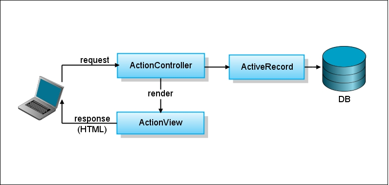
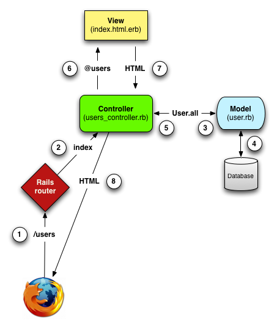
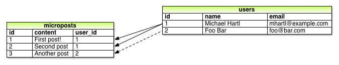

!SLIDE subsection

# Ruby on Rails

!SLIDE

## MVC

# Command-Line Summary

## Creating a Rails project

    rails new my_app
    cd my_app

(Error? Try `gem install rails`)

## Versioning with Git

    git init
    git status
    git add .
    git status
    git commit -m "Initial commit"

## Deploying to Heroku

    heroku create
    git push heroku master

# Heroku troubleshooting

* `gem install heroku` gives you the `heroku` command
* `heroku keys:add` registers your *ssh key* with Heroku
* in your project's `Gemfile`, make sure `pg` is in the `production` group and `sqlite3` is in the `development` group

        group :development, :test do
          gem 'sqlite3'
        end
        group :production do
          gem 'pg'
        end

* Linux only: add the `therubyracer` gem to your `Gemfile`

        gem 'therubyracer', :platform => :ruby

# Onto a Real (Demo) App

## We're following Michael Hartl's Rails Tutorial

<http://ruby.railstutorial.org/>

# Create App

    rails new demo_app
    cd demo_app
    echo "rvm use 1.9.3@rails3" > .rvmrc
    git init

# Create a Scaffold for User

A scaffold is a vertical slice of application, including a database migration, a model, as well as controller, and views for basic CRUD operations.

    rails generate scaffold User name:string email:string

# A note on Rails conventions

* Tables
    * Lower case and plurals, e.g. `users`
    * They represent many users

* Models
    * CamelCase and singular, e.g. `User`
    * Models are Ruby Classes
    * An instance of a model represents a single database record

# Migrating

    rake db:migrate

* A *migration* is a little script that changes the database schema
* When you run `rake db:migrate`, Rails applies *all* the migrations that have *not yet been applied* to the current database
* This allows you to change the development schema ahead of changing the production schema
  * when you deploy to production, run `rake db:migrate` and get *all the new migrations*

# A look at the model

    rails console

    > User.create!(:name => 'Joe', :email => 'joe@example.com')
    > User.find(1)

# Restful Routes

`config/routes.rb`:

    resources :users

`rake routes`:

        users GET    /users(.:format)          users#index
              POST   /users(.:format)          users#create
     new_user GET    /users/new(.:format)      users#new
    edit_user GET    /users/:id/edit(.:format) users#edit
         user GET    /users/:id(.:format)      users#show
              PUT    /users/:id(.:format)      users#update
              DELETE /users/:id(.:format)      users#destroy

# Named Routes

|named route|result|
|---|---|
|users_path | "/users" |
|new_user_path | "/users/new" |
|edit_user_path(u) | "/users/#{u.id}/edit" |
|user_path(u) | "/users/#{u.id}" |

There are also _url versions (when you really need the protocol and host) but _path is more portable.

!SLIDE

Source: (c) 2011, Michael Hartl, railstutorial.com

# Generated controllers

* Take a look at `app/controllers/users_controller`
* Note that each restful route correspond to a method (an "action")
* There are 7 of them:
    * `new`, `edit` -- serve forms to create a new or edit existing records
    * `index`, `show` -- list all or a single record
    * `create`, `update` -- process a form post for creating or updating a record
    * `delete` -- removing a record

# Problems with Scaffold

* No data validations
* No authentication or access protection
* Both HTML and XML responses -- often not warranted
* Tests are boilerplate, and not very robust
* No real understanding

# Controllers

# Accessing controller instance variables in views

* In a view, controller instance variables are copied into self

`users_controller.rb`:

    def show
      @user = User.find(params[:id])
    end

`user.html.erb`:

    <%= @user.name >

# Accessing controller instance variables in tests

* In a controller spec, controller instance variables are copied into the `assigns` array

`users_controller.rb`:

    def show
      @user = User.find(params[:id])
    end

`users_controller_spec.rb`:

    it "finds the user" do
      get :show, :id => 1
      assigns[:user].should_not be_nil  # accesses @user in controller
    end

# Time helpers

    1.day.ago
    2.weeks.since

    time_ago_in_words(Time.now)
    time_ago_in_words(1.day.ago)

# Form posts

    @@@ruby
    class UsersController < ApplicationController

       def create
         @user = User.create(params[:user])
         ...
       end
    ...
    end

# The `params` hash

* Form posts
  * Attributes with `name[...]` will turn into has keys
* Url components, as defined by routes
  * `match "/about/:page" => ...
  * produces a `:page` entry in `params`

# Views

# Rendering collections

`index.html.erb`:

    <% @users.each do |user| %>
      <tr>
        <td><%= user.name %></td>
        <td><%= user.email %></td>
      </tr>
    <% end %>

# Rendering collections via a partial (step 1)

Move it to a partial by the same name:

`_user.html.erb`:  (singular! and with a leading underscore)

    <tr>
      <td><%= user.name %></td>
      <td><%= user.email %></td>
    </tr>

# Rendering collections via a partial (step 2)

Then call it from the main view:

`index.html.erb` (one way)

    <% @users.each do |user| %>
      <%= render :partial => 'user', 
      :locals => {:user => user} %>
    <% end %>

`index.html.erb` (another way)

    <% @users.each do |user| %>
     <%= render :partial => 'user', :object => user %>
    <% end %>

# 

`index.html.erb` (another way)

    <% @users.each do |user| %>
     <%= render user %>
    <% end %>

`index.html.erb` (yet another way)

    <%= render @users %>

# Models

# Migrations

* start with a generator
  * `rails g migration MODEL field:type field:type`
  * e.g. `rails g migration User name:string age:integer`
* you must add extra indexes on your own
  * or `rails g migration add_some_indexes` makes an empty migration which you can fill in 
* Migrations are stored in the `db/migrate` directory

# Example Migration

This:

    rails generate scaffold User name:string email:string

Generates this:

    db/migrate/20120724185734_create_users.rb

Containing this:

    @@@ruby
    class CreateUsers < ActiveRecord::Migration
      def change
        create_table :users do |t|
          t.string :name
          t.string :email

          t.timestamps
        end
      end
    end

Which runs when you do this:

    rake db:migrate

# Brief ActiveRecord Tour

    rails c[onsole]

    u = User.new
    u = User.new(:name => "Joe Smith", :email => "joe@example.com")
    u.save  # returns 'false' on failure
    u.save! # raises exception on failure

    u = User.create(:name => "Joe Smith", :email => "joe@example.com")
    u = User.create!(:name => "Joe Smith", :email => "joe@example.com")

    u = User.find(1)
    u = User.where(:email => "joe@example.com").all

# Attribute Methods

Each column in the database auto-magically turns into a method on the model object, both setters and getters.

    @@@ruby
    u = User.new
    u.name = "Joe"
    u.name  # => "Joe"

# Instantiating vs. Creating

## In-memory operations
* `User.new({...})`
* `u.attributes = {...}`
* `u.name = ...`

`save` commits changes of an in-memory object to the database.

## Direct-to-DB operations

* `User.create({...})`
* `u.update_attribute(key, val)`
* `u.update_attributes({...})`

# Validations

* Secure data integrity at the model level
* Prevents bad data from entering the database
* Un-burdens controller or UI from messy validation code

# Validation Example

    @@@ruby
    class User < ActiveRecord::Base
        validates :name, :email,
                  :presence => true,
                  :length   => {:maximum => 256}
    end

# Active Record API

* find
* create
* count
* valid?
* changed?
* errors
* attributes, attributes=
* update_attribute(s)
* destroy

Reference: <http://railsapi.com/>

# Queries

## Compose queries with

* where
* order
* limit
* include
* join

## Then execute them with

* first
* last
* all

Reference: <http://guides.rubyonrails.org/active_record_querying.html>

# SQL Injection Guards

## NEVER use STRING INTERPOLATION in SQL conditions!!!

    str = 'joe'

    User.where("name = #{str}")   # This is UNSAFE!!! DON'T DO IT!

    User.where(["name = ?", str])  # This is safe

    # Alternatively, with hash keys substitution
    User.where(["name = :str AND email = :email", :str => str, :email => 'joe@example.com'])

# CRUD

## Class Methods

* new
* find
* create
* count

## Instance Methods

* attributes, attributes= (operates in-memory only)
* update_attribute(s) (saves right away)
* destroy
* various getters and setters, named after DB fields

# Destroyed Objects

### ... are frozen

    @@@ruby
    u = User.create(:name=>'Joe', :email=>'joe@example.com')
    u.destroy

    u.name  # => "Joe"
    u.id    # => ID

    # but:
    User.find(u.id)  # => Kaboom!

    u.frozen?  #  => true

Frozen objects can't be modified

# ARel Queries

## Compose queries with

* where
  * where(:name => 'Joe')
  * where(["email LIKE ?", '%example.com'])
* order
  * order('name ASC')
* limit
* include
* join

## Then execute them with

* first
* last
* all
* count

# Finders

    User.find(4)   # raises exception if not found

    User.find_by_id(4)  # return nil

    # also:

    User.find_by_name("Joe")

# Synchronizing Databases

    gem install taps
    heroku db:pull

<https://devcenter.heroku.com/articles/taps>

# Protecting attributes

## `attr_accessible`

* Whitelist of attributes that are mass-assignable, i.e.

        User.create!(:name => "Joe", :email => "joe@example.com")

* Don't make privileged data mass-assignable!

# Microposts

    rails generate model Micropost content:string user_id:integer

    rake db:migrate

# Validations for Micropost

    @@@ruby
    class Micopost < ActiveRecord::Base
        validates :content,
                  :presence => true,
                  :length   => {:maximum => 140}
    end

<http://guides.rubyonrails.org/active_record_validations_callbacks.html#validation-helpers>

# Associations

Associations relate one model to another, e.g. via *foreign keys* or *join tables*.

    @@@ruby
    class User < ActiveRecord::Base
      has_many :microposts
    end

    class Micropost < ActiveRecord::Base
      belongs_to :user
    end

!SLIDE

# A closer look

    rails console

    > u = User.find(1)
    > u.microposts.create(:content => "Hello World")

# Deploy

    # create .gitignore file
    git init
    git add .
    git commit -m 'initial commit'

    heroku create
    git push heroku master
    heroku rake db:migrate

# Scopes

## Named queries

    @@@ruby
    class ShippingAddress < ActiveRecord::Base

      has_many :orders

      scope :us, where(:country => "US")
      scope :in_state, lambda {|st| where(:state => st) }

      scope :on_file, lambda { includes(:orders).order('orders.created_at DESC').where('orders.created_at > ?', 12.months.ago) }
    end

# Many-to-many relationships

    @@@ruby
    class Product
      has_many :order_line_items
    end

    class OrderLineItem
      belongs_to :product
      belongs_to :user
    end

    class User
      has_many :order_line_items
      has_many :products, :through => :order_line_items
    end

# Test Data

* Factory data is for testing
* Permits quick creation of a few records

## Define the factory

    Factory.define(:user) do |f|
      f.name "Joe"
      f.email "joe@example.com"
    end

## to produce users

    Factory(:user)  # =>  User record with name=="Joe", ...

